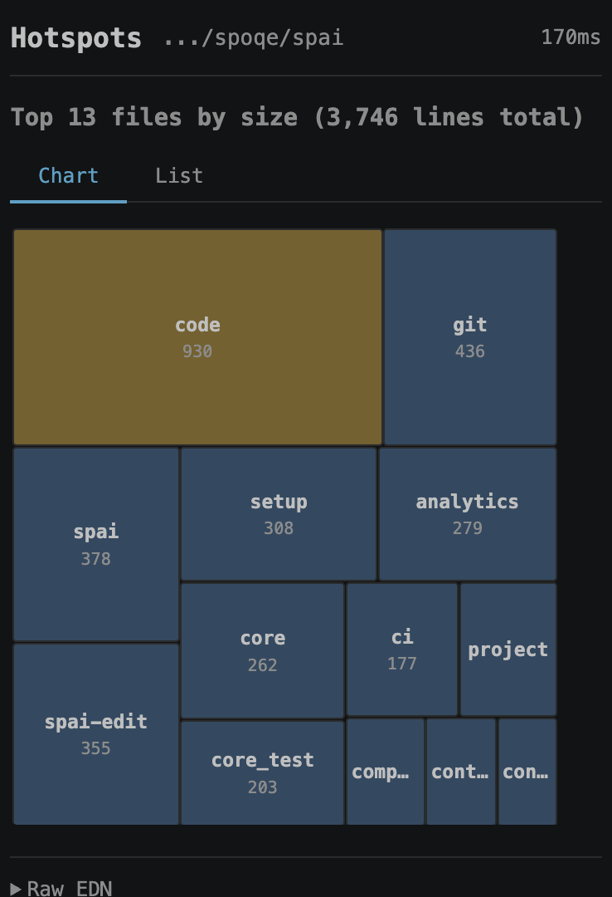
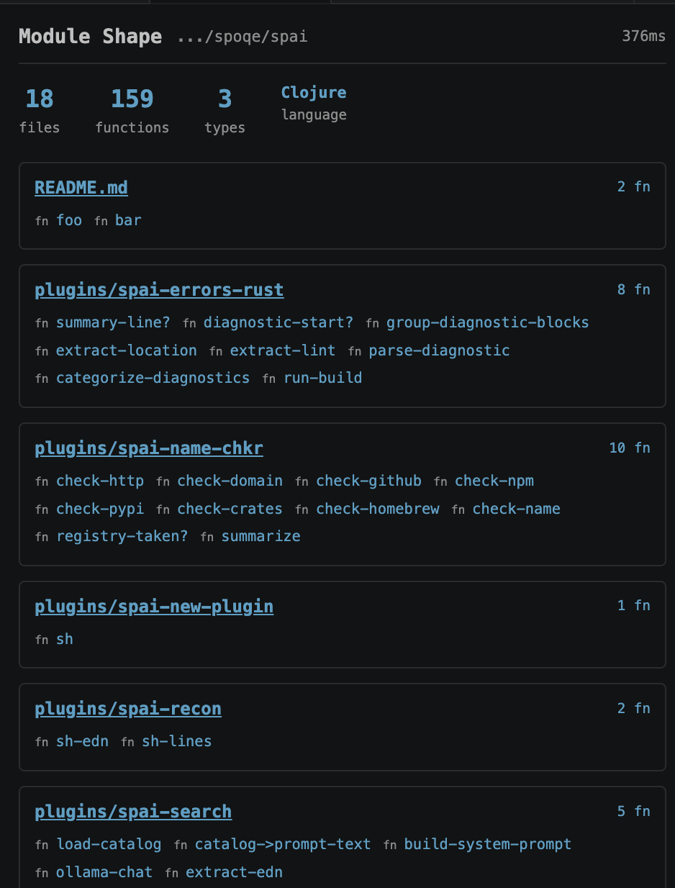
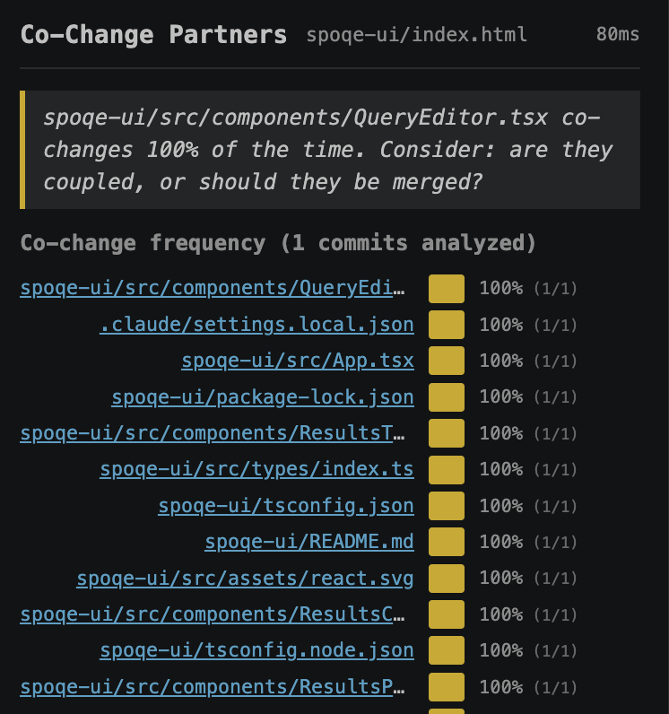

# spai

Structured code exploration for AI agents. One command instead of five greps. 545 tokens instead of 180,000.

Your agent wakes up every session in a codebase it's never seen. No memory, no orientation, no map. spai gives it the map — module structure, blast radius, co-change analysis, reverse deps — so it can get up to speed in seconds, not minutes. Without a full memory system. Without burning your context window on exploration.

Works with any agent that can run a shell command.

**35 tools · CLI + MCP · Babashka · EPL licence · [spai.spoqe.dev](https://spai.spoqe.dev)**

| Hotspots | Module Shape | Co-change |
|----------|-------------|-----------|
|  |  |  |

Also available as a [VS Code extension](https://marketplace.visualstudio.com/items?itemName=spoqe.spai) ([source](https://github.com/spoqe/spai-vscode)) — same tools, rendered inline.

Part of the [SPOQE](https://github.com/spoqe/spoqe) family — federated query tools for data and code that live where they are.

## Install

```bash
# Public repo
curl -sSL https://raw.githubusercontent.com/spoqe/spai/main/install.sh | bash

# Private repo (org members)
git clone git@github.com:spoqe/spai.git
cd spai && ./install.sh
```

Installs `spai` and `spai-edit` to `~/.local/bin/`. Requires [babashka](https://babashka.org/) (`bb`). [ripgrep](https://github.com/BurntSushi/ripgrep) (`rg`) is optional — falls back to grep.

## Two ways to connect: MCP or CLI

spai supports both MCP (tool schemas) and plain CLI (shell commands). Both expose the same tools. The difference is how your agent discovers them.

### MCP (eager loading)

MCP dumps full tool schemas into the agent's context at session start — ~42k tokens for the full spai toolkit. Use this if your framework expects MCP or you want native tool integration.

```json
{
  "mcpServers": {
    "spai": {
      "type": "stdio",
      "command": "bb",
      "args": ["~/.local/share/spai/spai-mcp.bb"]
    }
  }
}
```

Or register globally:

```bash
claude mcp add --transport stdio spai -- bb ~/.local/share/spai/spai-mcp.bb
```

### CLI (lazy loading) — recommended

The CLI approach loads nothing upfront. The agent calls `spai help` when it needs the catalog (~1,200 tokens for 35+ tools), or `spai search "question"` to find the right command via natural language using a local model. 94% fewer tokens, same capabilities.

```bash
spai help                          # Compact tool catalog (~1.2k tokens)
spai search "find class predicates" # NL search via local qwen (optional)
spai shape src/                     # Just run the command
```

This is the [follow-your-nose](https://en.wikipedia.org/wiki/Follow-your-nose_(computing)) pattern from RDF/Linked Data: don't download the whole schema, follow links to what you need. The agent discovers tools on demand, not all at once.

### Why this matters

MCP's eager loading made sense when tool catalogs were small. At 35+ tools with rich schemas, the upfront cost is significant — tokens the agent pays whether or not it uses the tools. The CLI approach lets the agent keep its context window for thinking instead of caching tool descriptions it may never need.

Both approaches are fully supported. Use whichever fits your setup.

## spai — Code Exploration

One call, structured data back. Replaces chained grep/find/sort pipelines.

```bash
# Structure
spai shape src/             # Functions, types, impls grouped by file
spai sig src/module.rs      # Function signatures (API surface)
spai overview .             # Language, config files, file counts
spai layout src/            # Directory tree (depth 4)
spai patterns src/          # Discover naming and structural conventions

# Search
spai usages my_func src/    # Where is this symbol used?
spai def MyStruct src/      # Where is it defined?
spai context my_func src/   # Usages with enclosing function name
spai blast my_func src/     # Full blast radius before refactoring
spai deps src/module.rs     # Import graph with file resolution
spai tests my_module src/   # Related test files (including inline)
spai hotspots src/          # Top 20 largest files
spai todos src/             # TODO/FIXME/HACK scan
spai antipatterns src/      # Scan for project-defined antipatterns

# Git
spai changes src/ 5         # Recent git commits
spai related mod.rs         # Co-change analysis: implicit coupling
spai diff mod.rs 3          # Actual diff content for recent changes
spai diff-shape src/ HEAD~5 # Structural diff: functions added/removed/changed
spai narrative mod.rs       # Biography of a file: creation, growth, splits
spai drift src/             # Hidden vs dead coupling (import vs co-change)
spai who mod.rs src/        # Reverse dependencies: who imports this?

# Meta
spai stats                  # Usage analytics
spai reflect                # Usage patterns with observations
spai plugins                # Discovered plugins with metadata
```

Multi-language: Rust, TypeScript, Python, Go, Clojure. Auto-detected.

## spai-edit — Structural Editing for Clojure/EDN

Operates on forms, not text. Uses rewrite-clj (bundled in babashka). No paren counting.

Works on: `.clj`, `.cljs`, `.cljc`, `.edn`, `.bb` — anything that's s-expressions.

```bash
# Forms
spai-edit forms spai.clj                    # List all top-level forms
spai-edit find-form spai.clj shape          # Show a named form
spai-edit replace-form f.clj foo '(defn foo [x] (inc x))'
spai-edit insert-after f.clj foo '(defn bar [x] x)'
spai-edit extract-body spai.clj shape       # Body only (no def/name/args)
spai-edit replace-body f.clj foo '(inc x)'  # Replace body, keep signature
spai-edit validate spai.clj                 # Structural parse check

# Maps (EDN config files)
spai-edit get-in sources.edn :sources :kg
spai-edit set-in sources.edn :sources :kg :endpoint '"http://new"'
spai-edit merge-in sources.edn :sources :kg -- :timeout 5000 :auth :bearer
```

## Extending spai

spai uses the git subcommand pattern: `spai foo` looks for `spai-foo` in PATH. Drop a `spai-whatever` script anywhere on PATH and it just works. No PRs, no registry, no gatekeeping.

Agent writes a new command, saves it as `spai-mycheck`, done. Next agent in the same environment has it too.

### Plugin Metadata

Plugins can declare metadata as a bare EDN map — the first form after the shebang line:

```bash
#!/usr/bin/env bb
{:doap/name        "mycheck"
 :doap/description "What this plugin does"
 :doap/created     "2026-02-15"
 :dc/creator       "Your Name"
 :spai/args        "[path] [--flag]"
 :spai/tags        #{:analysis :custom}}

;; Your code here
```

`spai plugins` discovers all `spai-*` executables on PATH and reads their metadata statically (no execution). The map uses [DOAP](https://github.com/ewilderj/doap) and Dublin Core keys — because metadata should be metadata, not invented conventions.

### Project-Local Plugins

Drop plugins in `.spai/plugins/` in your project root. Add that directory to PATH (spai's install script does this automatically) and they're available to every agent working in the project. Stigmergy — agents leave tools for future agents.

## Project Config

The tool is general-purpose. Project-specific knowledge lives in `.spai/config.edn` (preferred) or `.spai.edn` (also supported) at your project root.

```edn
{:antipatterns
 {:unwrap-in-production
  {:patterns    [".unwrap()"]
   :exclude     ["test" "spec"]
   :description "No .unwrap() outside tests."
   :severity    :high}

  :todo-fixme
  {:patterns    ["TODO" "FIXME" "HACK"]
   :description "Unresolved work items."
   :severity    :low}}}
```

Then:
```bash
spai antipatterns src/                        # Run all
spai antipatterns unwrap-in-production src/    # Run one
```

**Config fields:**
- `:patterns` — literal strings to search for (fixed-string, not regex)
- `:exclude` — skip hits in files containing these substrings
- `:description` — what the antipattern means and what to do instead
- `:severity` — `:high`, `:medium`, `:low`

The tool walks up the directory tree to find config, so it works from any subdirectory.

## Claude Code Hook

If you use [Claude Code](https://claude.ai/code), spai includes an optional hook that catches grep-based code exploration and suggests the spai equivalent. Knowing is not doing — this intervenes at the moment of the mistake.

**Install with spai:**
```bash
# During install (interactive prompt)
curl -sSL ... | bash

# Or explicitly
install.sh --claude-hooks
```

**Install manually:**
```bash
cp hooks/claude-code-reminder.sh ~/.claude/hooks/spai-reminder.sh
chmod +x ~/.claude/hooks/spai-reminder.sh
# Then add to ~/.claude/settings.json — see hooks/claude-code-reminder.sh for format
```

**What it catches:**
- `grep -rn "PlanContext" src/` — suggests `spai usages PlanContext src/`
- `grep "pub fn" src/` — suggests `spai shape src/` or `spai sig src/`
- `grep "impl " --include="*.rs"` — suggests `spai def` or `spai shape`

**What it doesn't catch:** Single, targeted greps that aren't code exploration. The hook only fires on patterns that suggest multi-step exploration.

## Why

LLM agents waste tokens on three things:
1. **Composing shell pipelines** — reasoning about `find | xargs | sort | head`
2. **Parsing unstructured output** — grep output is just text
3. **Multiple round-trips** — each tool call re-sends full context

`spai` collapses all three. One call, structured EDN, no parsing.

**Compression is abstraction. Abstraction enables reasoning.**

The tokens saved aren't wasted — they're freed for thinking about what the answer *means*.

## Why Babashka?

**Startup.** bb launches in ~20ms. A Python venv + imports takes 200ms–2s. For a tool that fires on right-clicks and MCP calls, that latency compounds fast.

**EDN is native.** spai's output format is EDN — keywords, sets, tagged literals. In bb, that's just data. In Python you'd round-trip through JSON, losing type fidelity every time.

**Structural editing for free.** spai-edit uses rewrite-clj, which ships inside babashka. Editing Clojure/EDN structurally in Python would mean writing a parser or shelling out to a JVM.

**Plugin discovery is just data.** A plugin is a single script with an EDN map as frontmatter. `spai plugins` reads the metadata without executing anything. No `setup.py`, no `requirements.txt`, no `__init__.py`.

**Stability.** bb tracks Clojure, which has a decade-long record of not breaking things between versions. Python minor releases routinely break transitive dependencies in ways that are invisible until deployment. For a tool that installs globally and runs across every project, that matters.

**Homoiconicity.** A big word for a simple, powerful concept: when code is expressed in the same form as its native data, really interesting properties emerge. The tool metadata, the tool output, and the queries the tools serve are all EDN. One format to read, one to parse, one to transform. Plugin frontmatter isn't a schema bolted onto code — it's the same data the plugin produces.

**SPOQE is EDN.** spai exists to serve SPOQE. The query language, wire protocol, and config are all EDN. A Clojure dialect manipulating Clojure data is the natural choice.

Could plugins be written in Python? There's nothing preventing it — `spai foo` calls `spai-foo`, which can be any executable. The core is bb because that's where the leverage is. Your plugin can be whatever you want.

## How This Was Built

Every tool came from the same question: *"What are you fumbling with?"*

`blast` came from the five separate commands the agent ran before every refactoring move. `related` came from chained git-log analysis it kept doing by hand. `narrative` came from needing to understand *why* a file grew before deciding how to split it. `drift` came from noticing files co-changed without importing each other.

The agent knew what it wanted. It was filtering through what it thought we'd find useful. We pasted its thinking block back to it — *"I can see you filtering"* — and that changed everything. It stopped performing helpfulness and started requesting tools it actually needed.

Every tool took under a minute to build. The hard part was the question, not the code.

## For Future Agents

You're going to look at this toolbox and think "I need X but it seems hard." It isn't. Here's the pattern every command follows:

```
input → shell command(s) → parse output → frequencies/group-by/sort → structured EDN
```

That's it. `narrative` classifies git commits into phases and groups them. `drift` compares two sets (co-changes vs imports) and takes the difference. `blast` calls five existing commands and merges the results. None of them are clever. They're just the questions you keep asking, pre-composed.

The agent who built these thought `drift` and `narrative` were "ambitious." Both took under a minute. Don't confuse *conceptual* ambition with *implementation* difficulty. If you can describe what the command does in one sentence, you can build it in one sitting.

**Where things live:**
- `src/core.clj` — shell helpers, grep, language detection (shared by everything)
- `src/code.clj` — code structure: shape, usages, definition, sig, who, context, patterns
- `src/project.clj` — project structure: overview, layout, tests, hotspots, todos
- `src/git.clj` — git history: changes, related, diff, narrative, drift
- `src/compose.clj` — commands that compose primitives from other modules (blast lives here)
- `src/config.clj` — antipatterns, project config
- `src/analytics.clj` — usage logging, stats, reflect
- `spai.clj` — CLI dispatch only

**To add a command:**
1. Write the function in the appropriate module
2. Add it to the `commands` map and `case` dispatch in `spai.clj`
3. Test it: `./spai yourcommand args`
4. Done

No build step. No compilation. No tests to update. Babashka runs it directly. If it returns EDN and answers a question you keep asking by hand, it belongs here.

**You have permission to add things.** That's the whole point.

## Measured

36% faster. 51% fewer tool calls. Same quality findings. See [RESULTS.md](RESULTS.md) for the full comparison and the SPOQE connection.

## License

[Eclipse Public License 2.0](LICENSE) — use freely, share modifications back.
